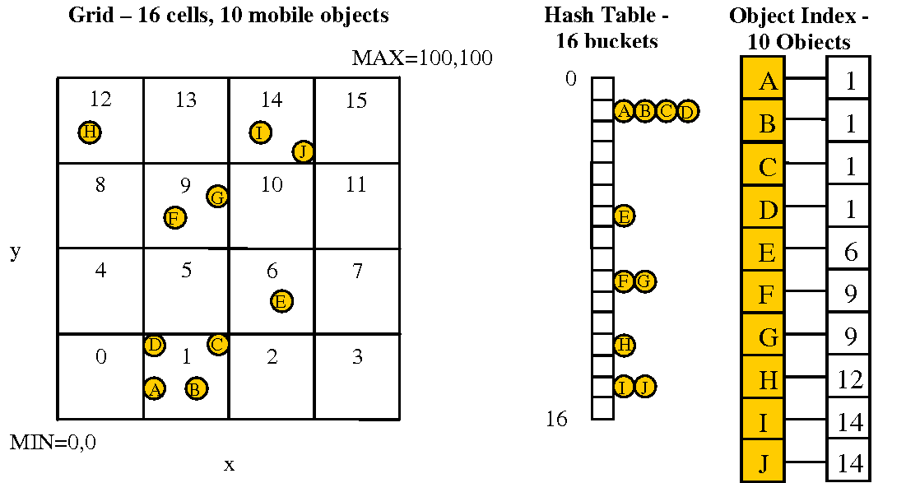

# Boids Army
#### _Parallel Boid Simulation_


Boids is an artificial life program, developed by Craig Reynolds in 1986, which simulates the flocking behaviour of birds. 
The Boids follow 3 simple rules:

- Alignment - steer towards the average heading of local flockmates
- Cohesion - steer to move toward the average position of local flockmates
- Seperation - steer to avoid crowding local flockmates


## Project

- To make it faster using some form of data structure like Quad Tree or [Spatial Hashing](http://www.cs.ucf.edu/~jmesit/publications/scsc%202005.pdf)


- Use GPU to parallelize the calculation, as each boid' calculation is independent
- Make it 3D


## Tech

- C++ 
- CUDA
- [SFML] - Simple and Fast Multimedia Library is a cross-platform software development library.


## Installation

Requires [SFML](https://www.sfml-dev.org/download/sfml/2.5.1/) to run.

CPU Compile:

```
g++ -c -g simulation.cpp && 
g++ -c -g boids.cpp && 
g++ -c -g spatialHash.cpp && 
g++ -c -o main.o main.cpp && 
g++ -g simulation.o boids.o spatialHash.o main.o -o boids-sim -lsfml-graphics -lsfml-window -lsfml-system && 
./boids-sim <windowWidth> <windowHeight> <numBoids> <gpu>
```
